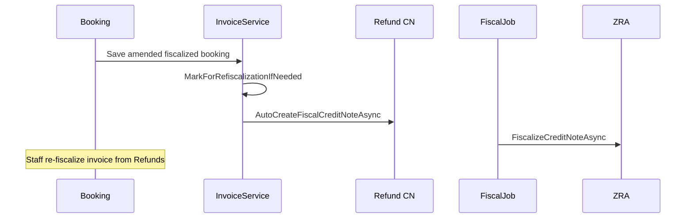

# Auto Credit Note After Fiscalization (AppIt)

When a **fiscalized** booking is amended, AppIt must reverse the prior fiscal document before re-fiscalizing the new invoice.

## Sequence

## Implementation

- `InvoiceService.MarkForRefiscalizationIfNeeded` sets `IsReadyToRefiscalize`, snapshots baseline JSON.
- `FiscalCreditNoteService` creates pending credit note linked to original fiscal receipt.
- `FiscalJob` processes pending CNs then pending invoices when `FiscalIntegration:ZraEnabled=true`.
- When `ZraEnabled=false`, fiscal fields update in DB only (dev mode).

## UI

- Refunds / credit-notes operational flow shows refiscalization queue.
- Booking modal fiscal banner when `IsReadyToRefiscalize`.
