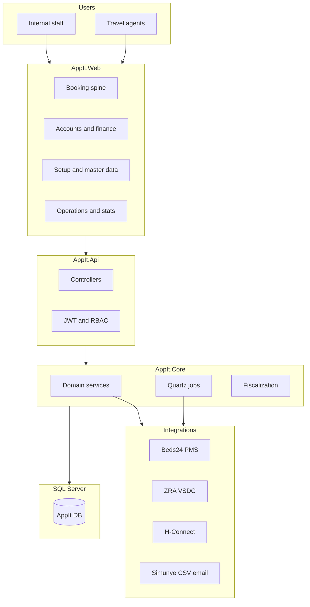

# AppIt — Full System Functionality Diagnosis

**Document type:** Living system inventory and functional diagnosis  
**Scope:** Entire AppIt monolith (`.NET` API + Angular SPA) as implemented in this repository  
**Audience:** Developers, QA, product owners, senior reviewers  
**Last updated:** 2026-06-15  
**GoldenDusk parity target:** Full operational parity per implementation plan

**Related docs:** [keyWorkflows.md](../keyWorkflows.md) · [system-pages-and-booking-lifecycle.md](./system-pages-and-booking-lifecycle.md) · [README.md](../README.md)

---

## 1. Executive summary

**AppIt** is a hospitality/tourism operations platform (GoldenDusk parity target). Monolithic stack:

| Layer | Technology | Role |
|-------|------------|------|
| Frontend | Angular 20 SPA (`AppIt.Web`) | Staff + guest UI: booking, accounts, setup, reports |
| API | ASP.NET Core (`AppIt.Api`) | REST endpoints, auth, report hosting |
| Business logic | `AppIt.Core` | Domain services, fiscalization, integrations, Quartz jobs |
| Data | EF Core + SQL Server (`AppIt.Data`) | Entity types, migrations |
| Reports | RDLC (`AppIt.Report`) + client jsPDF | PDF/Excel outputs |
| Fiscal device | `SmartInvoice.Vsdc` | ZRA VSDC client (device state in `AppIt.Data`) |

Functional surface: **~55+ navigable UI routes**, **~60+ API controllers**, **8 scheduled jobs**, **4+ external integrations**.

---

## 2. Functional domain map

Each domain lists **purpose**, **primary UI**, **primary API/services**, **gap status** (✅ implemented, 🔄 partial, ❌ planned).

### 2.1 Authentication and authorization — ✅

| Aspect | Detail |
|--------|--------|
| **Purpose** | Staff login, password reset; feature/permission gates |
| **UI** | `/auth/login`, `/access` |
| **API** | `AuthController`, `AccountController`, `RolesController`, `FeaturesController`, `PermissionsController` |
| **Mechanism** | JWT; `AuthService` stores token in `localStorage` |
| **RBAC** | `Role` → `RoleFeature` → `RoleFeaturePermission`; `buildWorkspaceMenu()` + `GET /api/auth/permissions` |
| **Diagnosis** | Register/forgot-password routes not exposed in UI yet. |

### 2.2 Reservation and booking (core spine) — 🔄

| Aspect | Detail |
|--------|--------|
| **Purpose** | Create/manage bookings enquiry → close; multi-product sales; payments |
| **UI** | `/admin/reservations/booking` (`BookingWizardPage` modal), groups, calendars, flow-charts |
| **API** | `ReservationController`, `BookingController`, `TripAccountsController`, `PaymentsController`, `ComboController` |
| **Status flow** | Enquiry → Provisional → Confirmed → Closed (Cancelled from any) |
| **Product types** | Accommodation, Activity, Transfer, Tour, Product, Combo, Miscellaneous |
| **Rate hierarchy** | Contract → Special → Agent → Rack (`PricingService`) |
| **Key behaviours** | Combo splits; shortfall/surplus misc; credit-agent validation |
| **Diagnosis** | Largest UI surface (`booking-wizard.page.ts`). Combo + splits wired in parity phase. |

### 2.3 Trip accounts and groups — ✅

| Aspect | Detail |
|--------|--------|
| **UI** | `/admin/reservations/groups` (`EntitiesPage` trip-accounts) |
| **API** | `TripAccountsController` |

### 2.4 Product catalog and pricing (setup) — 🔄

| Aspect | Detail |
|--------|--------|
| **UI** | `/admin/setup/manage-*` via `EntitiesPage` |
| **API** | Products, Accommodations, Activities, Transfers, Tours, ServicePrices, ProductCategories |
| **Diagnosis** | Combos via `ComboController`; silos/mapping/budgets routes in Phase 9. |

### 2.5 Agent rates and special rates — 🔄

| Aspect | Detail |
|--------|--------|
| **UI** | `/admin/setup/manage-agent-rates`, `/special-rates/*`, `/agent-portal/*` |
| **API** | `ProductPriceAgentController`, `SpecialProductPricesController` |
| **Diagnosis** | Dual approval paths. See [ManageAgentRates.md](./ManageAgentRates.md). |

### 2.6 Financial documents — invoicing — 🔄

| Aspect | Detail |
|--------|--------|
| **UI** | Booking invoice tab; `/admin/accounts/invoicing` |
| **API** | `InvoiceController`, `ReservationFinancialDocumentsController` |
| **Diagnosis** | Server RDLC path via `AppIt.Report`; jsPDF fallback in reports page. |

### 2.7 Fiscalization (ZRA) — 🔄

| Aspect | Detail |
|--------|--------|
| **API** | `FiscalController` |
| **Jobs** | `FiscalJob` (every 5 min when `ZraEnabled=true`) |
| **Services** | `FiscalService`, `FiscalCreditNoteService`, `FiscalSetupService` |
| **Storage** | Device/CIS state in `AppIt.Data` (`VsdcDeviceInfo`, `VsdcCodeEntry`) — no separate Persistence project |
| **Diagnosis** | See [auto-credit-note-after-fiscalization.md](./auto-credit-note-after-fiscalization.md). |

### 2.8 Credit notes, refunds, credit memos — 🔄

| Aspect | Detail |
|--------|--------|
| **UI** | `/admin/accounts/credit-notes`, `/admin/accounts/refunds` |
| **API** | `CreditNotesController`, `RefundsController`, `CreditMemosController` |

### 2.9 Payments, proof of payment, cashier — 🔄

| Aspect | Detail |
|--------|--------|
| **UI** | Booking payment tab; `/admin/cashier/*`, `/admin/accounts/proof-of-payments` |
| **API** | `PaymentsController`, `ProofOfPaymentsController`, `CashierController`, `ExchangeRatesController` |
| **Payments** | Stripe, PayPal, Manual + webhooks |

### 2.10 Debtors, commissions, statements — 🔄

| Aspect | Detail |
|--------|--------|
| **UI** | `/admin/accounts/debtors`, `/admin/accounts/commissions`, deposit-reports |
| **API** | `DebtorReportController`, `CommissionsController`, `TrialBalanceController` |
| **Diagnosis** | Auto-commission on close; credit agent auto-close rules. |

### 2.11 Accounting — day-end and journals — 🔄

| Aspect | Detail |
|--------|--------|
| **API** | `DayEndController`, `NightAuditController`, `TrialBalanceController` |
| **Jobs** | `EndOfDayJob` (22:30) — night audit → journals |
| **Entities** | `FinancialAccount`, `JournalEntry`, `JournalEntryLine` |

### 2.12 Operations — check-in and PMS — 🔄

| Aspect | Detail |
|--------|--------|
| **UI** | `/admin/operations/check-in`, `/admin/operations/hconnect-management` |
| **API** | `HConnectController` |
| **Jobs** | `HConnectSyncJob` |

### 2.13 Availability, occupancy, Beds24 — 🔄

| Aspect | Detail |
|--------|--------|
| **UI** | availability-calendar, occupancy-calendar, occupancy-details |
| **API** | `OccupancyController`, `VillageController` |
| **Jobs** | `Beds24ApiCallJob`, `SyncRoomsInventoryJob` |

### 2.14 Reporting and statistics — 🔄

| Aspect | Detail |
|--------|--------|
| **UI** | `/admin/statistics/*`, `/admin/dashboards/*`, flow-charts |
| **API** | `AllReportsController`, `ReportingController`, `AdminStatsController` |
| **Cache** | `CacheRefreshJob`, FusionCache + Redis |

### 2.15 User activity and audit — ✅

| Aspect | Detail |
|--------|--------|
| **UI** | `/admin/administration/user-activity` |
| **API** | `AuditLogController` |

### 2.16 Legacy migration and sync — 🔄

| Aspect | Detail |
|--------|--------|
| **Jobs** | `SimunyeJob` |
| **Docs** | [migration-cutover.md](./migration-cutover.md) |

### 2.17 Agent portal (external) — 🔄

| Aspect | Detail |
|--------|--------|
| **UI** | `/agent-portal/manage-rates/:agentId/:year/:name` (no main layout) |

---

## 3. Frontend route catalog

See [system-pages-and-booking-lifecycle.md](./system-pages-and-booking-lifecycle.md) Part 8 for the full page table (~55 routes).

**Page archetypes:** `BookingWizardPage`, `OperationalFlowPage`, `EntitiesPage`, `ReportsPage`.

---

## 4. Backend API catalog

| Domain | Controllers |
|--------|-------------|
| Auth | `Auth`, `Account`, `Roles`, `Features`, `Permissions`, `RoleFeaturePermissions` |
| Reservation | `Reservation`, `Booking`, `TripAccounts`, `Combo`, `ComboProductPrice` |
| Products | `Products`, `Accommodations`, `Activities`, `Transfers`, `Tours`, `ProductCategories` |
| Pricing | `ServicePrices`, `SpecialProductPrices`, `ProductPriceAgent`, `Pricing` |
| Finance | `Invoice`, `Payments`, `CreditNotes`, `CreditMemos`, `Refunds`, `Fiscal`, `ProofOfPayments` |
| Reports | `AllReports`, `Reporting`, `DebtorReport`, `TrialBalance`, `AdminStats` |
| Operations | `DayEnd`, `NightAudit`, `HConnect`, `Occupancy`, `Village`, `Cashier` |
| Integrations | Beds24 + Simunye via background jobs |

---

## 5. Background jobs and schedules

| Job | Schedule | Function |
|-----|----------|----------|
| `EndOfDayJob` | Daily 22:30 | Night audit, journal posting |
| `FiscalJob` | Every 5 min | Fiscalize invoices + credit notes |
| `SimunyeJob` | Every 1 min | IMAP CSV import |
| `CurrencyExchangeRatesJob` | Daily 23:00 | FX rate sync |
| `SyncRoomsInventoryJob` | Hourly 4–22 | Beds24 inventory |
| `Beds24ApiCallJob` | Every 5 min | Beds24 API poll |
| `CacheRefreshJob` | Every 60 min | Reporting cache |
| `HConnectSyncJob` | Every 5 min | H-Connect retry sync |

**Config:** `Jobs:*` flags in `appsettings.json` (default `false` in Development).

---

## 6. External integrations

| System | Role |
|--------|------|
| Beds24 | Availability, occupancy, inventory |
| ZRA / SmartInvoice VSDC | Fiscal invoices and credit notes |
| H-Connect | Channel bookings, product mapping |
| Simunye | Legacy booking CSV import |
| Stripe / PayPal | Online payments |
| Redis | Report stats cache |

---

## 7. Feature-specific deep-dive documents

| Topic | Document |
|-------|----------|
| Combo products | [ComboProducts.md](./ComboProducts.md) |
| Agent rates | [ManageAgentRates.md](./ManageAgentRates.md) |
| Auto credit note after fiscalization | [auto-credit-note-after-fiscalization.md](./auto-credit-note-after-fiscalization.md) |
| Page/route map | [system-pages-and-booking-lifecycle.md](./system-pages-and-booking-lifecycle.md) |
| Migration cutover | [migration-cutover.md](./migration-cutover.md) |

---

## 8. How to use this document

1. **Onboarding** — Read §1–2, then the domain for your task.
2. **Impact analysis** — Domain in §2 → route in page map → API in §4.
3. **Regression testing** — Use workflow checklists in [keyWorkflows.md](../keyWorkflows.md).
4. **Keep current** — Update **gap status** when completing parity phases.

---

*For workflow sequence diagrams, see [keyWorkflows.md](../keyWorkflows.md).*
