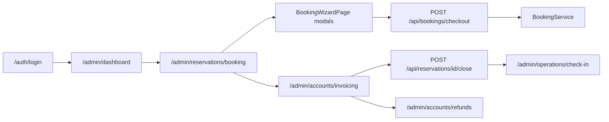
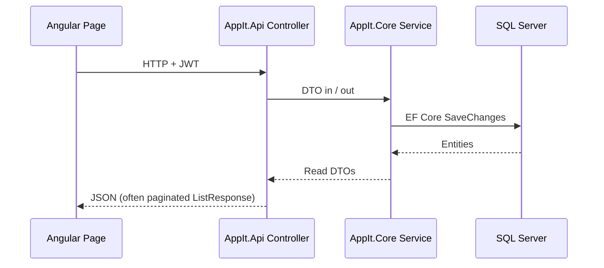
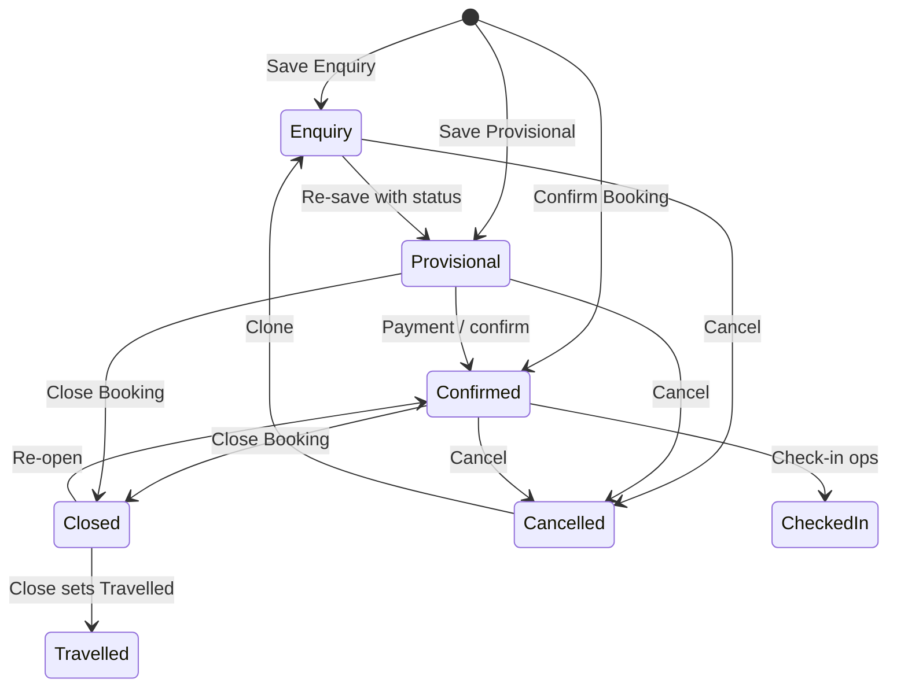

# AppIt System Pages and Booking Lifecycle

Page-by-page map of the AppIt Angular UI (`AppIt.Web`), centered on the booking start-to-end lifecycle. Adapted from the GoldenDusk reference architecture for the AppIt codebase running at **http://localhost:4200**.

---

## Part 1 — Architecture (how pages connect)

### Shell and navigation

| Layer | File | Role |
|-------|------|------|
| Layout shell | `AppIt.Web/src/app/layout/component/app.layout.ts` | Topbar + sidebar + `<router-outlet>` |
| Sidebar menu | `AppIt.Web/src/app/layout/component/app.menu.ts` | Builds menu from `buildWorkspaceMenu()` |
| Menu definition | `AppIt.Web/src/app/core/navigation/workspace-navigation.ts` | Feature groups, role features, permission filters |
| Routes | `AppIt.Web/src/app.routes.ts` | All registered paths (~45 admin + 5 user + auth) |

### Auth gates

| Guard | File | Behavior |
|-------|------|----------|
| `authGuard` | `auth.guard.ts` | Requires logged-in user; redirects to `/auth/login` |
| `adminGuard` | `auth.guard.ts` | Requires staff tier (`admin` / `super`); else `/access` |

Login lives at `/auth/login` (`AuthPage`). JWT is stored in `localStorage`; `auth.interceptor.ts` adds the bearer token and logs out on `401` when a token was sent.

### Page archetypes

AppIt uses four reusable page types instead of one component per GoldenDusk screen:

| Archetype | Component | Used for |
|-----------|-----------|----------|
| **Booking capture** | `booking-wizard.page.ts` | Admin + guest booking table, modal wizard, invoice/payment tabs |
| **Operational flow** | `operational-flow.page.ts` | Calendars, invoicing queue, check-in, exchange rates, day-end, etc. |
| **Entity CRUD** | `entities.page.ts` | Setup tables driven by `APPIT_ENTITIES` config |
| **Reports** | `reports.page.ts` | Report studio with filters + jsPDF export |

### Booking UX pattern

GoldenDusk uses a single route with modal overlays. AppIt follows the same pattern:

- **Route:** `/admin/reservations/booking` (staff) or `/user/bookings/new` (guest)
- **Shell:** `BookingWizardPage` — paginated booking table + PrimeNG dialogs
- **Not** a multi-route stepper; steps are tabs inside the "New Booking" modal

### End-to-end data flow

**Shared frontend API layer:** `ApiService` (`api.service.ts`) — `listPage`, `listAll`, `get`, `post`, `put`, `delete`, `checkoutBooking`, `count`.

**Authorization on API:** `ICurrentUserService` + `IResourceAuthorizationService` — staff vs account-scoped `/mine` endpoints; `403` on cross-account access.

---

## Part 2 — Booking spine (start → end)

### Lifecycle stages

| Stage | Route / UI | Component | Primary APIs | Status / side effect |
|-------|------------|-----------|--------------|----------------------|
| 1. Login | `/auth/login` | `AuthPage` | `POST /api/auth/login` | JWT issued |
| 2. Dashboard | `/admin/dashboard` | `AdminDashboardPage` | `GET /api/admin/stats`, entity counts | — |
| 3. Load bookings | `/admin/reservations/booking` | `BookingWizardPage` | `GET /api/reservations` (staff) or `GET /api/reservations/mine` (guest) | — |
| 4. New booking modal | Same route, dialog | `BookingWizardPage` | `GET /api/trip-accounts`, `/api/consultants`, `/api/customers` search | — |
| 5. Service lines | Modal step 2 | `BookingWizardPage` | `GET /api/products`, `/api/accommodations`, `/api/activities`, `/api/transfers`, `/api/tours`, `GET /api/pricing/quote` (optional), `GET /api/exchange-rates/effective` | Prices via `PricingService` on checkout |
| 6. Payment review | Modal step 3 | `BookingWizardPage` | Payment fields embedded in checkout DTO | `paymentStatus` on reservation |
| 7. Save | Enquiry / Provisional / Confirm buttons | `BookingWizardPage` | `POST /api/bookings/checkout` | `Enquiry` / `Provisional` / `Confirmed` |
| 8. View / edit | Row actions → detail dialog | `BookingWizardPage` | `GET /api/reservations/{id}`, `PUT /api/reservations/{id}` | Update status manually |
| 9. Add services | Product Details tab | `BookingWizardPage` | `POST /api/reservations/{id}/service-items`, `DELETE .../service-items/{itemId}` | Recalculates invoice total (API) |
| 10. Invoice tab | Payment Details tab | `BookingWizardPage` | `GET /api/invoices/reservation/{id}`, `POST/PUT/DELETE /api/invoices` | Invoice Pending/Paid |
| 11. Close booking | Table or edit modal | `BookingWizardPage` / `OperationalFlowPage` | `POST /api/reservations/{id}/close` | `Closed`, `Travelled`, voucher `Redeemed` |
| 12. Invoicing queue | `/admin/accounts/invoicing` | `OperationalFlowPage` | `GET /api/reservations` (filtered) + close | Fiscal / statement prep |
| 13. Credit / refund | `/admin/accounts/credit-notes`, `/admin/accounts/refunds` | `OperationalFlowPage` / `EntitiesPage` | `/api/credit-notes`, `/api/refunds` | Credit note lifecycle |
| 14. Check-in | `/admin/operations/check-in` | `OperationalFlowPage` | `POST /api/reservations/{id}/check-in` | `TravelStatus: CheckedIn` |
| 15. Cancel / clone | Table actions | `BookingWizardPage` | `POST /api/reservations/{id}/cancel`, `/clone`, `/open` | `Cancelled` or new `Enquiry` clone |

### Checkout orchestration (`BookingService.CheckoutAsync`)

Single transaction creates:

1. **Customer** — resolve or create from DTO
2. **Reservation** — `ReservationService.CreateAsync` with status from UI
3. **ReservationServiceItems** — priced via `PricingService.ResolveUnitPriceAsync`
4. **Invoice** — `InvoiceService.CreateAsync`
5. **Payment** — `PaymentService.ProcessAsync` (syncs `Reservation.PaymentStatus`)
6. **ProofOfPayment** — optional URL linked to payment
7. **Voucher** — `VoucherService` with reservation reference

Controller: `BookingController` → `POST /api/bookings/checkout`

### Status transition rules

Frontend sets initial status on checkout (`submitWithStatus`). Backend enforces transitions on dedicated endpoints.

**Payment status values:** `NotPaid`, `Deposited`, `FullyPaid` (set during checkout and recalculated on cancel).

**Travel status values:** `NotCheckedIn`, `CheckedIn`, `Travelled`.

### History / audit

- Reservation snapshots: `GET /api/reservations/{id}/snapshots` (`ReservationSnapshot` table)
- User activity page: `GET /api/audit-logs` via operational flow

### NgRx note

GoldenDusk uses NgRx for reservation state. **AppIt does not use NgRx** — booking state is local to `BookingWizardPage` signals and refreshed via `loadBookings()` after mutations.

---

## Part 3 — Reservation module pages

| Route | Component | Data loaded | User actions | Booking relationship |
|-------|-----------|-------------|--------------|----------------------|
| `/admin/reservations/booking` | `BookingWizardPage` | Paginated reservations, catalog forkJoin on modal open | Search, filter, new/edit/close/cancel/clone | **Core capture** |
| `/admin/reservations/groups` | `EntitiesPage` (`trip-accounts`) | `GET /api/trip-accounts` | CRUD agents / trip accounts | Pre-booking agent setup |
| `/admin/reservations/reports` | `ReportsPage` (`reportGroup: Reservations`) | Report definitions from API metadata | Generate, filter, PDF | Post-booking reporting |
| `/admin/reservations/availability-calendar` | `OperationalFlowPage` (`availability-calendar`) | `GET /api/reservations` | Table view of availability rows | Pre-booking planning |
| `/admin/reservations/occupancy-calendar` | `OperationalFlowPage` (`occupancy-calendar`) | `GET /api/reservations` | Occupancy by reservation volume | Ops planning |
| `/admin/reservations/flow-charts` | `OperationalFlowPage` (`flow-charts`) | `GET /api/reservations` | Chart source data table | Analytics |

**Menu path:** Reservations → (item). **Permissions:** filtered by `ROLE_FEATURES` + `GET /api/auth/permissions` (e.g. `New Booking`, `Edit or Confirm`).

**Not yet routed in AppIt** (present in GoldenDusk): `/reservation/occupancy-details`, `/reservation/my-cashup`.

---

## Part 4 — Accounts module (booking end-state)

| Route | Component | API | Role in lifecycle |
|-------|-----------|-----|-------------------|
| `/admin/accounts/invoicing` | `OperationalFlowPage` | `GET /api/reservations` + `POST .../close` | Search closed bookings, close from queue |
| `/admin/accounts/credit-notes` | `OperationalFlowPage` | `GET/POST /api/credit-notes` | Issue credit notes |
| `/admin/accounts/refunds` | `EntitiesPage` | `GET/POST /api/refunds` | Process refunds |
| `/admin/accounts/commissions` | `OperationalFlowPage` | `GET /api/commissions` | Consultant commission tracking |
| `/admin/accounts/deposit-reports` | `ReportsPage` (`Accounts`) | Payment/deposit report endpoints | Agent deposit reporting |
| `/admin/accounts/proof-of-payments` | `OperationalFlowPage` | `GET /api/proof-of-payments` | Verify uploaded payment proof |

**Close → invoice path:** Closing a booking (`CloseBookingAsync`) sets `IsInvoiced`, creates invoice if missing, redeems voucher. Full fiscal integration (ZIMRA) is out of scope for AppIt v1; PDF export uses client-side jsPDF in reports and booking views.

---

## Part 5 — Operations, Cashier, Statistics

### Operations

| Route | Component | API | Booking link |
|-------|-----------|-----|--------------|
| `/admin/operations/check-in` | `OperationalFlowPage` | Reservations list + check-in POST | Post-booking guest travel |
| `/admin/operations/day-end` | `OperationalFlowPage` | `GET/POST /api/day-end` | Daily revenue audit |

### Cashier

| Route | Component | API | Booking link |
|-------|-----------|-----|--------------|
| `/admin/cashier/exchange-rates` | `OperationalFlowPage` | `GET/POST /api/exchange-rates` | FX for checkout + PDF totals |
| `/admin/cashier/bank-note-details` | `OperationalFlowPage` | `GET /api/cashier/bank-note-details` | Payment denomination breakdown |
| `/admin/cashier/reports` | `ReportsPage` (`Cashier`) | Payment reports | Cashier reconciliation |

### Statistics

| Route | Component | API | Booking link |
|-------|-----------|-----|--------------|
| `/admin/statistics/all-reports` | `ReportsPage` | Multiple report paths via metadata | BI / departmental reports |
| `/admin/statistics/executive-stats` | `ExecutiveStatsPage` | `GET /api/admin/stats` | Executive KPI dashboard |

---

## Part 6 — Setup and administration

Setup pages use `EntitiesPage` with `APPIT_ENTITIES` config — each maps `key` → REST endpoint.

| Route | Entity key | Endpoint | Feeds booking via |
|-------|------------|----------|-------------------|
| `/admin/setup/manage-companies` | `companies` | `/api/companies` | Agent / company on reservation |
| `/admin/setup/manage-products` | `products` | `/api/products` | Product line items |
| `/admin/setup/manage-service-prices` | `service-prices` | `/api/service-prices` | `PricingService` |
| `/admin/setup/manage-special-prices` | `special-product-prices` | `/api/special-product-prices` | Discounted unit prices |
| `/admin/setup/manage-consultants` | `consultants` | `/api/consultants` | `AgencyConsultantId` on booking |
| `/admin/setup/manage-suppliers` | `suppliers` | `/api/suppliers` | Service line supplier |
| `/admin/setup/manage-currencies` | `currencies` | `/api/currencies` | Currency catalog |
| `/admin/setup/manage-departments` | `departments` | `/api/departments` | Org structure / reports |
| `/admin/setup/manage-product-categories` | `product-categories` | `/api/product-categories` | Service type grouping |
| `/admin/setup/manage-product-sub-categories` | `product-sub-categories` | `/api/product-sub-categories` | Finer catalog grouping |
| `/admin/setup/manage-features` | `features` | `/api/features` | RBAC feature areas |
| `/admin/setup/manage-permissions` | `permissions` | `/api/permissions` | Menu + action permissions |
| `/admin/administration/users` | `accounts` | `/api/accounts` | Login accounts |
| `/admin/administration/roles` | `roles` | `/api/roles` | Role names + `RoleFeaturePermissions` |
| `/admin/administration/user-activity` | — | `/api/audit-logs` | Audit trail |

Accommodation, activity, transfer, and tour catalogs are exposed as separate API controllers (`/api/accommodations`, etc.) and loaded in the booking wizard — not separate admin routes yet.

---

## Part 7 — Auth, guest portal, utilities

### Auth routes

| Route | Component | API |
|-------|-----------|-----|
| `/auth/login` | `AuthPage` | `POST /api/auth/login` |
| `/access` | `AccessPage` | — (forbidden role) |
| `/notfound` | `NotFoundPage` | — |

Password reset UI on `AuthPage`: `POST /api/auth/password-reset/request`, `POST /api/auth/password-reset/confirm`.

### Guest portal (`/user/*`, `authGuard`)

| Route | Component | APIs |
|-------|-----------|------|
| `/user/dashboard` | `UserDashboardPage` | `/api/reservations/mine`, `/api/invoices/mine`, `/api/vouchers/mine`, catalog lists |
| `/user/bookings/new` | `BookingWizardPage` | Same as admin booking, scoped to current account |
| `/user/support` | `SupportPage` | `/api/support/messages` |
| `/user/notifications` | `NotificationsPage` | `/api/notifications` |
| `/user/settings` | `SettingsPage` | `/api/user-profiles` |

### Admin utilities

| Route | Component | Purpose |
|-------|-----------|---------|
| `/admin/support` | `SupportPage` | Staff support inbox |
| `/admin/notifications` | `NotificationsPage` | Notification center |
| `/admin/settings` | `SettingsPage` | Profile / preferences |

**Not implemented:** agent portal, special-rates approval routes, secure PDF viewer, `/profiling/profile`, `/theming` (GoldenDusk orphans).

---

## Part 8 — Page catalog appendix

| Path | Component | Shell | In menu | Permissions (examples) | Booking phase |
|------|-----------|-------|---------|------------------------|---------------|
| `/auth/login` | AuthPage | — | — | — | auth |
| `/access` | AccessPage | — | — | — | auth |
| `/admin/dashboard` | AdminDashboardPage | AppLayout | Home | — | admin |
| `/admin/reservations/booking` | BookingWizardPage | AppLayout | Reservations | New Booking, Edit or Confirm | **create** |
| `/admin/reservations/groups` | EntitiesPage | AppLayout | Reservations | Add/Edit/Delete Agent | setup |
| `/admin/reservations/reports` | ReportsPage | AppLayout | Reservations | View Trip Accounts | post-close |
| `/admin/reservations/availability-calendar` | OperationalFlowPage | AppLayout | Reservations | New Booking | pre-booking |
| `/admin/reservations/occupancy-calendar` | OperationalFlowPage | AppLayout | Reservations | New Booking | pre-booking |
| `/admin/reservations/flow-charts` | OperationalFlowPage | AppLayout | Reservations | Print or View Charts | analytics |
| `/admin/cashier/exchange-rates` | OperationalFlowPage | AppLayout | Cashier | Exchange Rate | setup |
| `/admin/cashier/bank-note-details` | OperationalFlowPage | AppLayout | Cashier | BankNote Details | pay |
| `/admin/cashier/reports` | ReportsPage | AppLayout | Cashier | Cashier Reports | post-close |
| `/admin/accounts/invoicing` | OperationalFlowPage | AppLayout | Accounts | Search for Invoice | **close** |
| `/admin/accounts/credit-notes` | OperationalFlowPage | AppLayout | Accounts | Create Credit Notes | post-close |
| `/admin/accounts/refunds` | EntitiesPage | AppLayout | Accounts | Process Refund | post-close |
| `/admin/accounts/commissions` | OperationalFlowPage | AppLayout | Accounts | View Commissions | post-close |
| `/admin/accounts/deposit-reports` | ReportsPage | AppLayout | Accounts | Deposit Reports | post-close |
| `/admin/accounts/proof-of-payments` | OperationalFlowPage | AppLayout | Accounts | Proof Of Payment | pay |
| `/admin/statistics/all-reports` | ReportsPage | AppLayout | Statistics | By Department, etc. | admin |
| `/admin/statistics/executive-stats` | ExecutiveStatsPage | AppLayout | Statistics | Executive Stats | admin |
| `/admin/operations/check-in` | OperationalFlowPage | AppLayout | Operations | Print or View Travelled PAX | post-close |
| `/admin/operations/day-end` | OperationalFlowPage | AppLayout | Operations | Open Day, Close Day | admin |
| `/admin/setup/manage-companies` | EntitiesPage | AppLayout | Setup | Add/Edit Company | setup |
| `/admin/setup/manage-products` | EntitiesPage | AppLayout | Setup | Add/Edit Product | setup |
| `/admin/setup/manage-service-prices` | EntitiesPage | AppLayout | Setup | Add/Edit Product | setup |
| `/admin/setup/manage-departments` | EntitiesPage | AppLayout | Setup | Edit Departments | setup |
| `/admin/setup/manage-suppliers` | EntitiesPage | AppLayout | Setup | Add/Edit Supplier | setup |
| `/admin/setup/manage-currencies` | EntitiesPage | AppLayout | Setup | Add/Edit Currency | setup |
| `/admin/setup/manage-consultants` | EntitiesPage | AppLayout | Setup | Add/Edit Consultant | setup |
| `/admin/setup/manage-product-categories` | EntitiesPage | AppLayout | Setup | Add/Edit Category | setup |
| `/admin/setup/manage-product-sub-categories` | EntitiesPage | AppLayout | Setup | Add Sub-Category | setup |
| `/admin/setup/manage-special-prices` | EntitiesPage | AppLayout | Setup | Add Special Price | setup |
| `/admin/setup/manage-features` | EntitiesPage | AppLayout | Setup | Edit Features | admin |
| `/admin/setup/manage-permissions` | EntitiesPage | AppLayout | Setup | Edit Permissions | admin |
| `/admin/administration/users` | EntitiesPage | AppLayout | Administration | Activate User | admin |
| `/admin/administration/roles` | EntitiesPage | AppLayout | Administration | Edit Roles | admin |
| `/admin/administration/user-activity` | OperationalFlowPage | AppLayout | Administration | System Log | admin |
| `/admin/support` | SupportPage | AppLayout | System | — | admin |
| `/admin/notifications` | NotificationsPage | AppLayout | — | — | admin |
| `/admin/settings` | SettingsPage | AppLayout | System | — | admin |
| `/user/dashboard` | UserDashboardPage | AppLayout | Home | — | create |
| `/user/bookings/new` | BookingWizardPage | AppLayout | My AppIt | — | **create** |
| `/user/support` | SupportPage | AppLayout | My AppIt | — | admin |
| `/user/settings` | SettingsPage | AppLayout | My AppIt | — | admin |

### API controller index (backend)

| Area | Controllers |
|------|-------------|
| Auth | `AuthController` |
| Booking | `BookingController`, `ReservationController` |
| Catalog | `ProductsController`, `AccommodationsController`, `ActivitiesController`, `TransfersController`, `ToursController`, `ProductCategoriesController`, `ServicePricesController`, `SpecialProductPricesController` |
| Finance | `InvoiceController`, `PaymentsController`, `PaymentWebhooksController`, `VouchersController`, `CreditNotesController`, `RefundsController`, `ProofOfPaymentsController`, `CommissionsController` |
| Ops | `DayEndController`, `CashierController`, `ExchangeRatesController` |
| Setup | `CompaniesController`, `ConsultantsController`, `SupplierController`, `CurrenciesController`, `DepartmentsController`, `TripAccountsController`, `CustomerController` |
| Admin | `AccountController`, `RolesController`, `FeaturesController`, `PermissionsController`, `RoleFeaturePermissionsController`, `AuditLogController`, `AdminStatsController`, `PricingController` |
| Guest | `NotificationController`, `SupportMessagesController`, `UserProfilesController` |

---

## Quick answers

| Question | Answer |
|----------|--------|
| What does this page do? | See Parts 3–7 tables |
| How do I get there? | Sidebar menu → group → item (`workspace-navigation.ts`) |
| What API does it call? | See stage table in Part 2 or appendix endpoints |
| Where in booking start → end? | **Booking phase** column in Part 8 |

**Related:** [keyWorkflows.md](../keyWorkflows.md) · [memory-bank README](../README.md)
