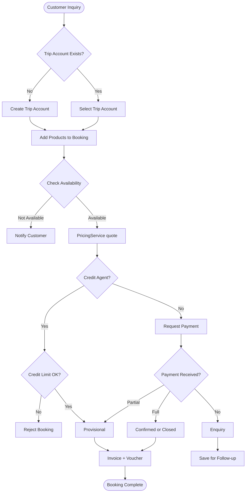
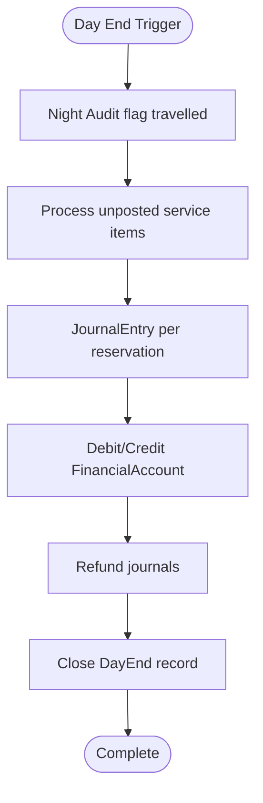

# AppIt Key Workflows

> **Full system map:** [system-functionality-diagnosis.md](./features/system-functionality-diagnosis.md)  
> **Route-level detail:** [system-pages-and-booking-lifecycle.md](./features/system-pages-and-booking-lifecycle.md)

---

## 1. Reservation Creation Workflow

### Overview

Core process from inquiry to confirmation. Implemented in `BookingWizardPage` + `BookingService.CheckoutAsync`.



### Step 1: Trip account

`BookingService` resolves `TripAccountId` from checkout DTO or creates via `TripAccountsController`.

### Step 2: Pricing (`PricingService.ResolveUnitPriceAsync`)

Rate priority: **Contract → Special → Agent → Rack**

```csharp
// AppIt.Core/Services/PricingService.cs
var unitPrice = await _pricing.ResolveUnitPriceAsync(
    serviceType, serviceId, currency, activityDate, consultantId);
```

Agent tier uses `AgentProductPrice` when approved for the activity year.

### Step 3: Credit validation (`CreditAgentService`)

```csharp
if (company.IsCreditAgent)
{
    var available = await _credit.GetAvailableCreditAsync(company.CompanyId);
    var outstanding = await _credit.GetOutstandingBalanceAsync(company.CompanyId);
    if (outstanding + totalAmount > available)
        throw new InvalidOperationException("Credit limit exceeded");
}
```

### Step 4: Status determination (`BookingStatusResolver`)

| Condition | Reservation Status | Payment Status |
|-----------|-------------------|----------------|
| Credit agent | Confirmed | NotPaid |
| Payment >= total | Closed | FullyPaid |
| Payment > 0 | Confirmed | Deposited |
| Else | Provisional | NotPaid |

Endpoint: `POST /api/bookings/checkout`

---

## 2. Day-End Financial Processing

### Overview

`EndOfDayJob` → `NightAuditService.ProcessReservationProductsAsync` → `DayEndService.RunJournalTransactionsAsync`.



Manual trigger: `GET /api/day-end/run-journal-transactions`

### Journal example (credit sale)

```
Dr. Agent Receivable     $1,000
    Cr. Revenue                    $800
    Cr. VAT Payable                $100
    Cr. Commission Payable         $100
```

---

## 3. Commission Calculation Workflow

Auto-accrual on `ReservationService.CloseAsync`:

```csharp
var rate = consultant?.CommissionRate ?? 0m;
var commission = reservation.TotalAmount * rate / 100m;
await _commissionService.CreateAsync(new Commission { ... });
```

Paid after travel date per commission report filters.

---

## 4. Credit Management Workflow

Credit agents (`Company.AgentType = Credit`) bypass upfront payment. Outstanding tracked via `DebtorReportService`.

Auto-close: when payments sum to invoice total, `ReservationService` may close credit booking.

---

## 5. Refund Processing Workflow

1. Staff creates refund → `POST /api/refunds`
2. If fiscalized → credit note path → `FiscalCreditNoteService`
3. Payment reversal → `RefundService` calls Stripe/PayPal when `PaymentProvider` set
4. Journal reversal on next day-end

---

## 6. Night Audit Workflow

`NightAuditService` marks service items with `ActivityDate < today` as travelled, sets `Reservation.TravelStatus = Travelled` where appropriate.

Precedes journal posting in `EndOfDayJob`.

---

## 7. Authentication

1. `POST /api/auth/login` → JWT
2. `AuthService` stores user + token
3. Staff → `/admin/dashboard`; guests → `/user/dashboard`
4. Menu from `buildWorkspaceMenu()` + permissions API

---

## 8. Guest self-service

`/user/bookings/new` uses same `BookingWizardPage` with `/api/reservations/mine` scope.

---

## 9. Setup → pricing → booking

Companies, products, service prices, special prices (with approval), agent rates, consultants, exchange rates feed `PricingService` at checkout.

---

## 10. Fiscal amendment cycle

See [auto-credit-note-after-fiscalization.md](./features/auto-credit-note-after-fiscalization.md).

---

## 11. Integrations (summary)

| Integration | Entry | Job |
|-------------|-------|-----|
| Beds24 | `VillageController`, `OccupancyController` | `Beds24ApiCallJob`, `SyncRoomsInventoryJob` |
| H-Connect | `HConnectController` | `HConnectSyncJob` |
| Simunye | `SimunyeService` | `SimunyeJob` |
| ZRA | `FiscalController` | `FiscalJob` |
